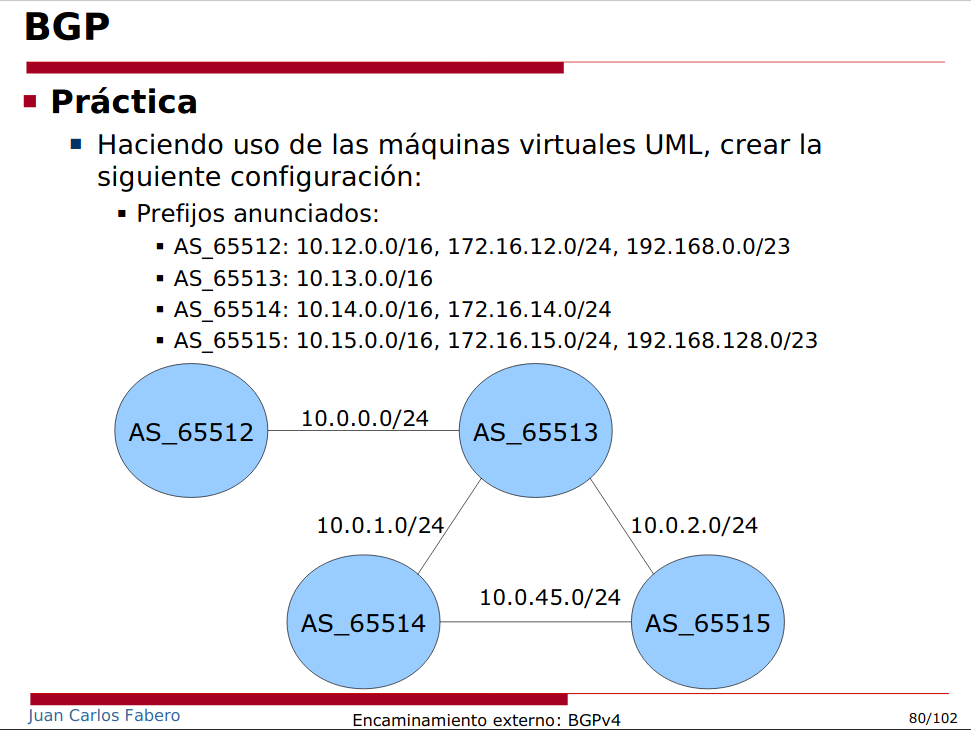
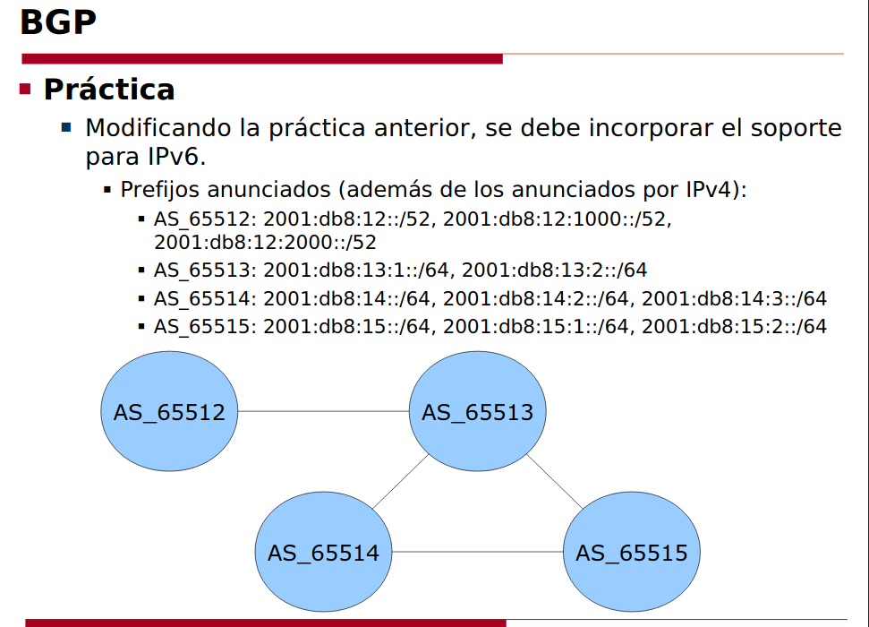

Definimos la topología:

**Máquina anfitriona:**

Creamos el archivo de configuración "net.conf" con el siguiente contenido:
<pre><code>defsw br12 uml1.0 uml2.2
defsw br23 uml2.1 uml3.0
defsw br24 uml2.0 uml4.1
defsw br34 uml3.1 uml4.0</code></pre>

Limpiamos configuraciones viejas con el comando:
<pre><code>sudo ifovsdel</code></pre>

Comprobamos que la sintaxis sea correcta con:
<pre><code>sudo ifovsparse net.conf</code></pre>

Creamos y lanzamos los directorios de las máquinas con:
<pre><code>mkdir uml{1..4}
lanza {1..4}</code></pre>

## **Configuración BGP**

