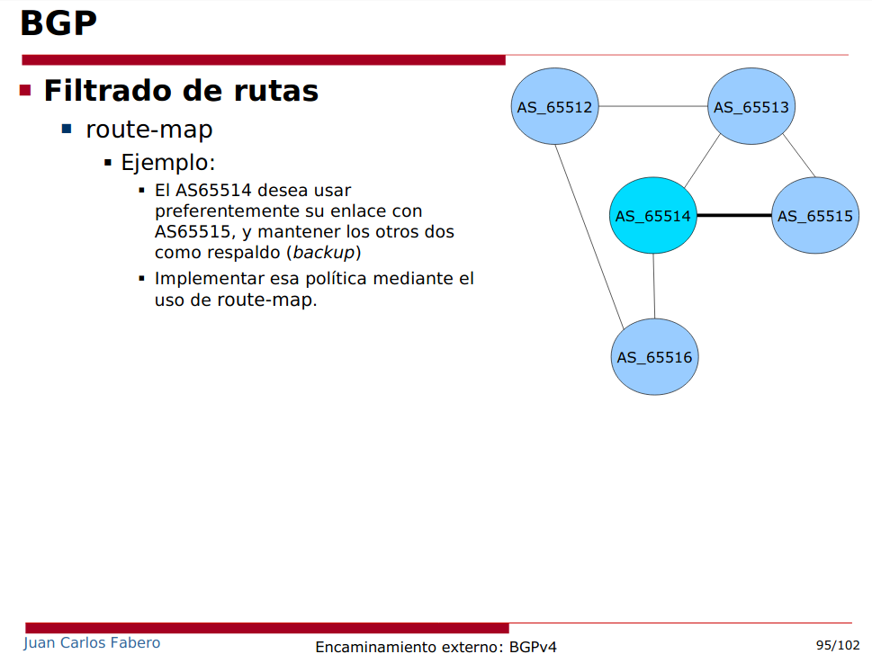

Definimos la topología:

**Máquina anfitriona:**

Creamos el archivo de configuración "net.conf" con el siguiente contenido:
<pre><code>defsw br12 uml1.0 uml2.2
defsw br15 uml1.1 uml5.1
defsw br23 uml2.1 uml3.0
defsw br24 uml2.0 uml4.1
defsw br34 uml3.1 uml4.0
defsw br35 uml3.2 uml5.0</code></pre>

Limpiamos configuraciones viejas con el comando:
<pre><code>sudo ifovsdel</code></pre>

Comprobamos que la sintaxis sea correcta con:
<pre><code>sudo ifovsparse net.conf</code></pre>

Creamos y lanzamos los directorios de las máquinas con:
<pre><code>mkdir uml{1..5}
lanza {1..5}</code></pre>

## **Configuración BGP**

Lo primero es activar el demonio zebra de bgpd en todas las máquinas. Esto es, colocando el flag a 'yes' bgpd, editando el archivo /etc/quagga/daemons. Despues hacemos restart del demonio zebra con:
<pre><code>systemctl restart quagga</code></pre>

Después hay que levantar los interfaces y asignar direcciones a las máquinas.

**UML1**

<pre><code>vtysh
# configure terminal
# interface eth0
# ip address 10.0.12.1/24
# exit
# interface eth1
# ip address 10.0.15.1/24
# exit
# router bgp 65512
# neighbor 10.0.12.2 remote-as 65513
# neighbor 10.0.15.5 remote-as 65516
# network 172.16.1.0/24
# end
# write</code></pre>

**UML2**

<pre><code>vtysh
# configure terminal
# interface eth0
# ip address 10.0.24.2/24
# exit
# interface eth1
# ip address 10.0.23.2/24
# exit
# interface eth2
# ip address 10.0.12.2/24
# exit
# router bgp 65513
# neighbor 10.0.24.4 remote-as 65515
# neighbor 10.0.23.3 remote-as 65514
# neighbor 10.0.12.1 remote-as 65512
# network 172.16.2.0/24
# end
# write</code></pre>

**UML3**

<pre><code>vtysh
# configure terminal
# interface eth0
# ip address 10.0.23.3/24
# exit
# interface eth1
# ip address 10.0.34.3/24
# exit
# interface eth2
# ip address 10.0.35.3/24
# exit
# ip as-path access-list fav permit ^65515_
# ip as-path access-list any permit .*
# ip as-path access-list as65513 permit ^65513_
# ip as-path access-list as65516 permit ^65516_
# route-map fav-link permit 10
# match as-path fav
# set local-preference 200
# exit
# route-map fav-link permit 20
# match as-path any
# exit
# route-map prepend-path permit 10
# match as-path as65513
# match as-path as65516
# set as-path prepend 65514 65514 65514
# set metric 100
# exit
# router bgp 65514
# neighbor 10.0.23.2 remote-as 65513
# neighbor 10.0.23.2 route-map prepend-path out
# neighbor 10.0.34.4 remote-as 65515
# neighbor 10.0.34.4 route-map fav-link in
# neighbor 10.0.35.5 remote-as 65516
# neighbor 10.0.35.5 route-map prepend-path out
# network 172.16.3.0/24
# end
# write</code></pre>

**UML4**

<pre><code>vtysh
# configure terminal
# interface eth0
# ip address 10.0.34.4/24
# exit
# interface eth1
# ip address 10.0.24.4/24
# exit
# router bgp 65515
# neighbor 10.0.24.2 remote-as 65513
# neighbor 10.0.34.3 remote-as 65514
# network 172.16.4.0/24
# end
# write</code></pre>

**UML5**

<pre><code>vtysh
# configure terminal
# interface eth0
# ip address 10.0.35.5/24
# exit
# interface eth1
# ip address 10.0.15.5/24
# exit
# router bgp 65516
# neighbor 10.0.35.3 remote-as 65514
# neighbor 10.0.15.1 remote-as 65512
# network 172.16.5.0/24
# end
# write</code></pre>

Se puede comprobar que la ruta para alcanzar las redes es la correcta, usa los siguientes comandos en las máquinas 3 y 5.
<pre><code># clear bgp *
# show ip bgp</code></pre>
