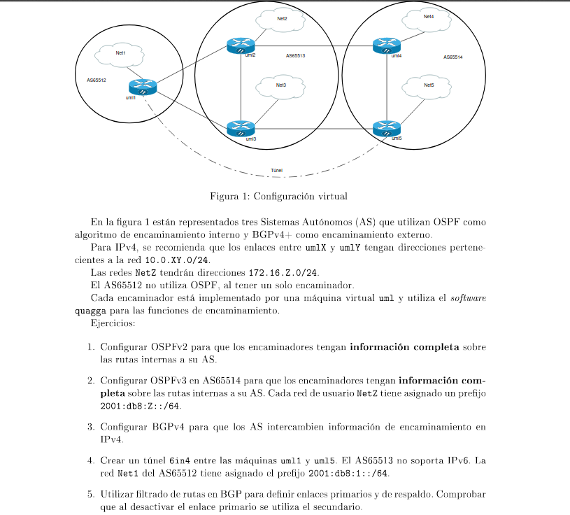

Definimos la topología:

**Máquina anfitriona:**

Creamos el archivo de configuración "net.conf" con el siguiente contenido:
<pre><code>defsw br12 uml1.0 uml2.3
defsw br13 uml1.1 uml3.3
defsw br1_0 uml1.2
defsw br2_0 uml2.0
defsw br24 uml2.1 uml4.2
defsw br23 uml2.2 uml3.0
defsw br3_0 uml3.1
defsw br35 uml3.2 uml5.2
defsw br4_0 uml4.0
defsw br45 uml4.1 uml5.0
defsw br5_0 uml5.1/code></pre>

Limpiamos configuraciones viejas con el comando:
<pre><code>sudo ifovsdel</code></pre>

Comprobamos que la sintaxis sea correcta con:
<pre><code>sudo ifovsparse net.conf</code></pre>

Creamos y lanzamos los directorios de las máquinas con:
<pre><code>mkdir uml{1..5}
lanza {1..5}</code></pre>

Lo primero es activar los demonios zebra de ospf(uml{2..5}), ospf6(uml{4..5}) y bgp(todas). Esto es, colocando los flags a 'yes', editando el archivo /etc/quagga/daemons. Despues hacemos reiniciamos el demonio zebra con:
<pre><code>systemctl restart quagga</code></pre>

## Configuración del encaminamiento interior (OSPFv2 y OSPFv3)

**UML1:**

<pre><code>vtysh
# configure terminal
# interface eth0
# ip address 10.0.12.1/24
# exit
# interface eth1
# ip address 10.0.13.1/24
# exit
# interface eth2
# ip address 172.16.1.1/24
# exit
# ip forwarding
# end
# write</code></pre>

**UML2:**

<pre><code>vtysh
# configure terminal
# interface eth0
# ip address 172.16.2.2/24
# exit
# interface eth1
# ip address 10.0.24.2/24
# exit
# interface eth2
# ip address 10.0.23.2/24
# exit
# interface eth3
# ip address 10.0.12.2/24
# exit
# ip forwarding
# router ospf
# router-id 0.0.0.2
# network 172.16.2.0/24 area 0
# network 10.0.23.0/24 area 0
# passive-interface eth0
# end
# write</code></pre>

**UML3:**

<pre><code>vtysh
# configure terminal
# interface eth0
# ip address 10.0.23.3/24
# exit
# interface eth1
# ip address 172.16.3.3/24
# exit
# interface eth2
# ip address 10.0.35.3/24
# exit
# interface eth3
# ip address 10.0.13.3/24
# exit
# ip forwarding
# router ospf
# router-id 0.0.0.3
# network 172.16.3.0/24 area 0
# network 10.0.23.0/24 area 0
# passive-interface eth1
# end
# write</code></pre>

**UML4:**

<pre><code>vtysh
# configure terminal
# interface eth0
# ip address 172.16.4.4/24
# no ipv6 nd suppress-ra
# ipv6 nd prefix 2001:db8:4::/64
# ipv6 address 2001:db8:4::4/64
# ipv6 ospf6 passive
# exit
# interface eth1
# ip address 10.0.45.4/24
# exit
# interface eth2
# ip address 10.0.24.4/24
# exit
# ip forwarding
# ipv6 forwarding
# router ospf
# router-id 0.0.0.4
# network 172.16.4.0/24 area 0
# network 10.0.45.0/24 area 0
# passive-interface eth0
# exit
# router ospf6
# router-id 0.0.0.4
# interface eth0 area 0.0.0.0
# interface eth1 area 0.0.0.0
# end
# write</code></pre>

**UML5:**

<pre><code>vtysh
# configure terminal
# interface eth0
# ip address 10.0.45.5/24
# exit
# interface eth1
# ip address 172.16.5.5/24
# no ipv6 nd suppress-ra
# ipv6 nd prefix 2001:db8:5::/64
# ipv6 address 2001:db8:5::5/64
# ipv6 ospf6 passive
# exit
# interface eth2
# ip address 10.0.35.5/24
# exit
# ip forwarding
# ipv6 forwarding
# router ospf
# router-id 0.0.0.5
# network 172.16.5.0/24 area 0
# network 10.0.45.0/24 area 0
# passive-interface eth1
# exit
# router ospf6
# router-id 0.0.0.5
# interface eth0 area 0.0.0.0
# interface eth1 area 0.0.0.0
# end
# write</code></pre>

Podemos comprobar que la configuración es correcta, ya que solo se comparten direcciones dentro de las áreas, y no fuera.

## Configuración del encaminamiento exterior (BGP)
