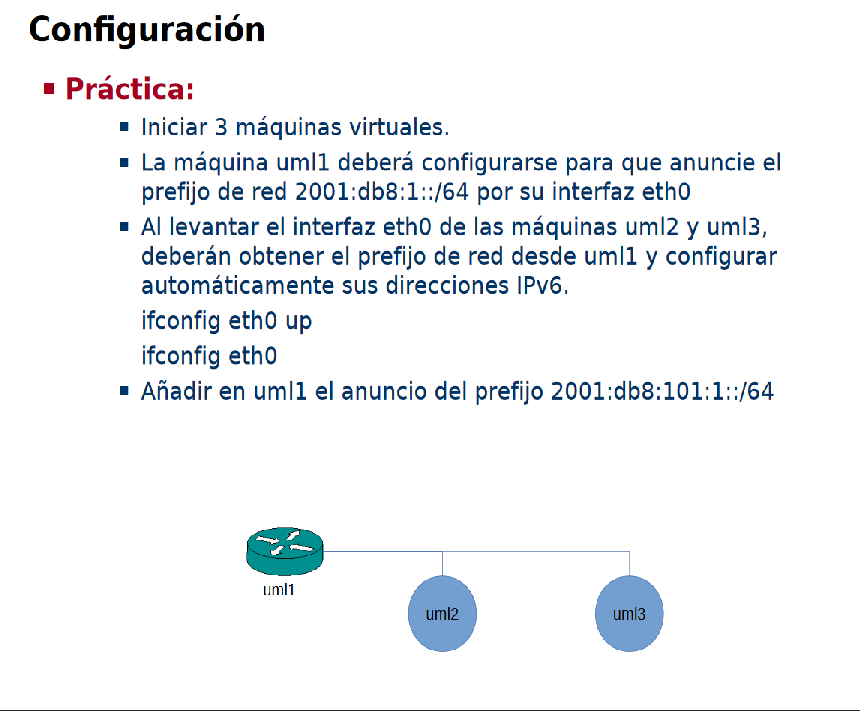

Empezamos definiendo la topología:

*Máquina anfitriona:*

Creamos el archivo de configuración "net.conf" con el siguiente contenido:
<pre><code>defsw br123 uml1.0 uml2.0 uml3.0</code></pre>

Limpiamos configuraciones viejas con el comando:
<pre><code>sudo ifovsdel</code></pre>

Comprobamos que la sintaxis sea correcta con:
pre><code>sudo ifovsparse net.conf</code></pre>

Creamos y lanzamos los directorios de las máquinas con:
<pre><code>mkdir uml{1..3}
lanza {1..3}</code></pre>

*UML1:*

Configuramos el router 1 para el anuncio de prefijos
<pre><code>vtysh
# configure terminal
# interface eth0
# no ipv6 nd suppress-ra
# ipv6 nd prefix 2001:db8:1::/64
# ipv6 nd prefix 2001:db8:101:1::/64
# end
# write</code></pre>

*UML3:*

<pre><code>ifconfig eth0 up</code></pre>

*UML2:*
<pre><code>ifconfig eth0 up</code></pre>
Ahora podremos hacer un ping a UML3, eso si, hay que especificar el interfaz de salida.
<pre><code>ping6 -c 1 fe80::ff:fe00:3f0%eth0</code></pre>

