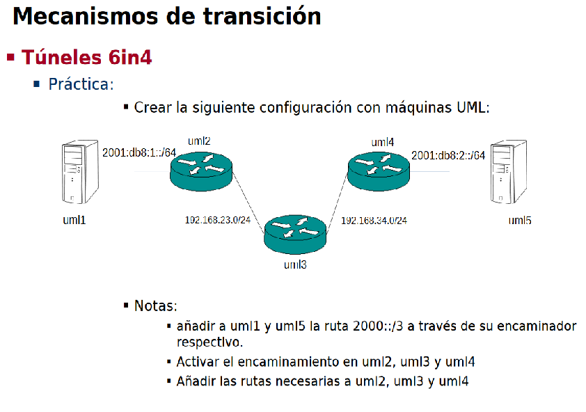

Empezamos definiendo la topología:

*Máquina anfitriona:*

Creamos el archivo de configuración "net.conf" con el siguiente contenido:
<pre><code>defsw br12 uml1.0 uml2.0
defsw br23 uml2.1 uml3.0
defsw br34 uml3.1 uml4.0
defsw br45 uml4.1 uml5.0</code></pre>

Limpiamos configuraciones viejas con el comando:
<pre><code>sudo ifovsdel</code></pre>

Comprobamos que la sintaxis sea correcta con:
<pre><code>sudo ifovsparse net.conf</code></pre>

Creamos y lanzamos los directorios de las máquinas con:
<pre><code>mkdir uml{1..5}
lanza {1..5}</code></pre>

*UML2:*

<pre><code>vtysh
# configure terminal
# interface eth0
# no ipv6 nd suppress-ra
# ipv6 nd prefix 2001:db8:1::/64
# ipv6 address 2001:db8:1::ff:fe00:1f2/64
# exit
# ipv6 forwarding
# interface eth1
# ip address 192.168.23.2/24
# exit
# ip route 0.0.0.0/0 192.168.23.3
# end
# write
# quit
</code></pre>

*UML1:*

<pre><code>vtysh
# configure terminal
# interface eth0
# no shutdown
# end
# write
# quit</code></pre>

Podemos comprobar la conexión de UML1 a UML2 con:
<pre><code>ping6 -c 1 2001:db8:1::ff:fe00:1f2</code></pre>

*UML4:*

<pre><code>vtysh
# configure terminal
# interface eth1
# no ipv6 nd suppress-ra
# ipv6 nd prefix 2001:db8:2::/64
# ipv6 address 2001:db8:2::ff:fe00:1f2/64
# exit
# ipv6 forwarding
# interface eth0
# ip address 192.168.34.4/24
# exit
# ip route 0.0.0.0/0 192.168.34.3
# end
# write
# quit
</code></pre>

*UML5:*

<pre><code>vtysh
# configure terminal
# interface eth0
# no shutdown
# end
# write
# quit</code></pre>

Podemos comprobar la conexión de UML5 a UML4 con:
<pre><code>ping6 -c 1 2001:db8:2::ff:fe00:1f2</code></pre>

*UML3:*

<pre><code>vtysh
# configure terminal
# interface eth0
# ip address 192.168.23.3/24
# no shutdown
# exit
# interface eth1
# ip address 192.168.34.3/24
# no shutdown
# exit
# ip forwarding
# end
# write
# quit</code></pre>
<pre><code></code></pre>

Podemos comprobar que efectivamente la red ipv4 es comunicable haciendo un ping de 2 a 4.

A continuación, vamos a configurar el tunel para conectar las dos redes ipv6 a través de la ipv4, el tunel será punto a punto.

*UML2:*

<pre><code>ip tunnel add extremo1 mode sit remote 194.168.34.4
ip link set dev extremo1 up mtu 1400
ip -6 route add default dev extremo1</code></pre>

*UML4:*

<pre><code>ip tunnel add extremo2 mode sit remote 194.168.23.2
ip link set dev extremo2 up mtu 1400
ip -6 route add default dev extremo2</code></pre>

De esta forma ya tenemos conectadas las máquinas 1 y 5, podemos comprobarlo si desde la máquina 5 hacemos un ping a 1.
<pre><code>ping6 -c 1 2001:db8:1::ff:fe00:1f0</code></pre>
