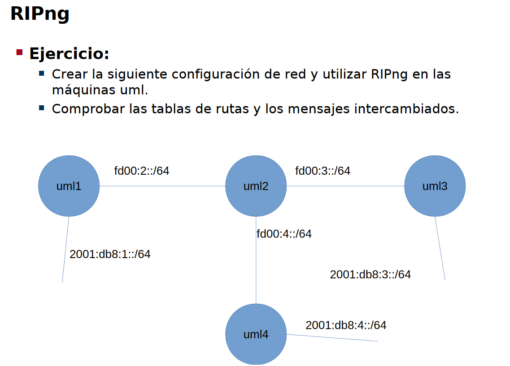

Definimos la topología:

**Máquina anfitriona:**

Creamos el archivo de configuración "net.conf" con el siguiente contenido:
<pre><code>defsw br1 uml1.0
defsw br12 uml1.1 uml2.0
defsw br24 uml2.1 uml4.0
defsw br23 uml2.2 uml3.0
defsw br4 uml4.1
defsw br3 uml3.1</code></pre>

Limpiamos configuraciones viejas con el comando:
<pre><code>sudo ifovsdel</code></pre>

Comprobamos que la sintaxis sea correcta con:
<pre><code>sudo ifovsparse net.conf</code></pre>

Creamos y lanzamos los directorios de las máquinas con:
<pre><code>mkdir uml{1..4}
lanza {1..4}</code></pre>

## **Configuración de RIPv2**

**UML1**

Lo primero es activar los demonios zebra de ripv2 y ripng. Esto es, colocando los flags a 'yes' de ripd y ripngd, editando el archivo /etc/quagga/daemons. Despues hacemos restart del demonio zebra con:
<pre><code>systemctl restart quagga</code></pre>

Seguidamente, levantamos ambos interfaces, le asignamos IP y activamos el forwarding.

<pre><code>vtysh
# configure terminal
# interface eth0
# ip address 172.16.1.1/24
# exit
# interface eth1
# ip address 192.168.1.1/24
# exit
# ip forwarding</code></pre>

Ahora vamos a configurar el protocolo RIPv2:

<pre><code>
# router rip
# network eth0
# network eth1
# passive-interface eth0
# end
# write</code></pre>

Hemos declarado el interfaz eth0 como pasivo para no propagar las comunicaciones del protocolo, debido a que por el interfaz eth0 pueden estar conectadas máquinas de usuario, las cuales no son routers.

Ahora tocar repetir la misma configuración para el resto de máquinas.

**UML2**

<pre><code>vtysh
# configure terminal
# interface eth0
# ip address 192.168.1.2/24
# exit
# interface eth1
# ip address 192.168.4.2/24
# exit
# interface eth2
# ip address 192.168.2.2/24
# exit
# ip forwarding
# router rip
# network eth0
# network eth1
# network eth2
# end
# write</code></pre>

**UML3**

<pre><code>vtysh
# configure terminal
# interface eth0
# ip address 192.168.2.3/24
# exit
# interface eth1
# ip address 172.16.3.3/24
# exit
# ip forwarding
# router rip
# network eth0
# network eth1
# passive-interface eth1
# end
# write</code></pre>

**UML4**

<pre><code>vtysh
# configure terminal
# interface eth0
# ip address 192.168.4.4/24
# exit
# interface eth1
# ip address 172.16.4.4/24
# exit
# ip forwarding
# router rip
# network eth0
# network eth1
# passive-interface eth1
# end
# write</code></pre>

Podemos comprobar la trasmisión de los mensajes RIPv2 con Wireshark, o viendo la tabla de rutas desde quagga con la instrucción:

<pre><code># show ip route</code></pre>

Además podemos comprobar que son alcanzables haciendo por ejemplo un ping de la máquina 1 a la 4.

## **Configuración de RIPng**

Igual que antes vamos a asignar direcciones y activar el protocolo ripng en todas las máquinas.

**UML1**

<pre><code>vtysh
# configure terminal
# interface eth0
# no ipv6 nd supress-ra
# ipv6 nd prefix 2001:db8:1::/64
# ipv6 address 2001:db8:1::1/64
# exit
# interface eth1
# ipv6 address fd00:2::1/64
# exit
# ipv6 forwarding
# router ripng
# network eth0
# network eth1
# passive-interface eth0
# end
# write</code></pre>

**UML2**

<pre><code>vtysh
# configure terminal
# interface eth0
# ipv6 address fd00:2::2/64
# exit
# interface eth1
# ipv6 address fd00:4::2/64
# exit
# interface eth2
# ipv6 address fd00:3::2/64
# exit
# ipv6 forwarding
# router ripng
# network eth0
# network eth1
# network eth2
# end
# write</code></pre>

**UML3**

<pre><code>vtysh
# configure terminal
# interface eth1
# no ipv6 nd supress-ra
# ipv6 nd prefix 2001:db8:3::/64
# ipv6 address 2001:db8:3::3/64
# exit
# interface eth0
# ipv6 address fd00:3::3/64
# exit
# ipv6 forwarding
# router ripng
# network eth0
# network eth1
# passive-interface eth0
# end
# write</code></pre>

**UML4**

<pre><code>vtysh
# configure terminal
# interface eth1
# no ipv6 nd supress-ra
# ipv6 nd prefix 2001:db8:4::/64
# ipv6 address 2001:db8:4::4/64
# exit
# interface eth0
# ipv6 address fd00:4::4/64
# exit
# ipv6 forwarding
# router ripng
# network eth0
# network eth1
# passive-interface eth0
# end
# write</code></pre>

Con esto, hemos conseguido que las máquinas tambien puedan comunicarse por RIPng. Podemos ver la tabla de rutas con:

<pre><code># show ipv6 route</code></pre>
