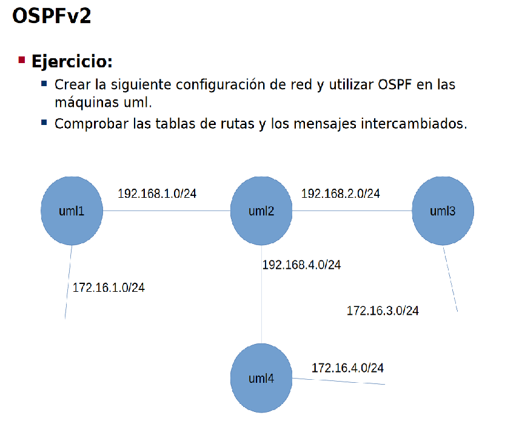
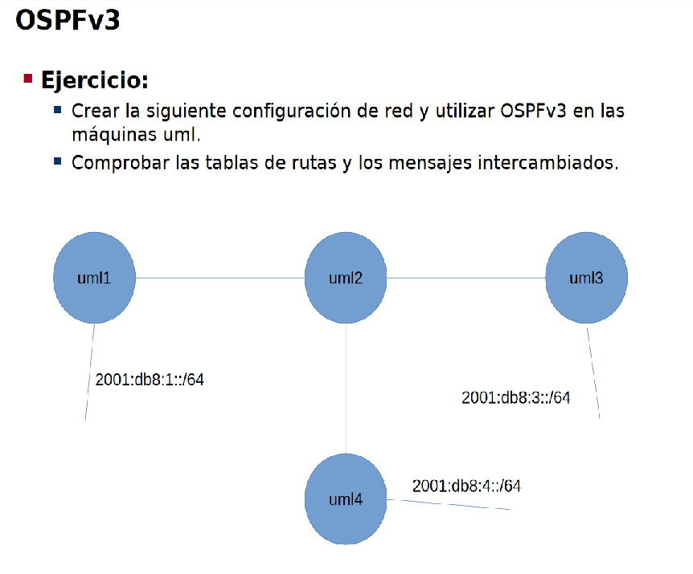

Definimos la topología:

**Máquina anfitriona:**

Creamos el archivo de configuración "net.conf" con el siguiente contenido:
<pre><code>defsw br12 uml1.0 uml2.2
defsw br1 uml1.1
defsw br24 uml2.1 uml4.0
defsw br23 uml2.0 uml3.1
defsw br4 uml4.1
defsw br3 uml3.0</code></pre>

Limpiamos configuraciones viejas con el comando:
<pre><code>sudo ifovsdel</code></pre>

Comprobamos que la sintaxis sea correcta con:
<pre><code>sudo ifovsparse net.conf</code></pre>

Creamos y lanzamos los directorios de las máquinas con:
<pre><code>mkdir uml{1..4}
lanza {1..4}</code></pre>

**UML{1..4}:**

Lo primero es activar los demonios zebra de ospf y ospf6. Esto es, colocando los flags a 'yes' de ospfd y ospf6d, editando el archivo /etc/quagga/daemons. Despues hacemos reiniciamos el demonio zebra con:
<pre><code>systemctl restart quagga</code></pre>

**UML1:**

<pre><code>vtysh
# configure terminal
# interface eth0
# ip address 192.168.1.1/24
# exit
# interface eth1
# ip address 172.16.1.1/24
# no ipv6 nd suppress-ra
# ipv6 nd prefix 2001:db8:1::/64
# ipv6 address 2001:db8:1::ff:fe00:1/64
# ipv6 ospf6 passive
# exit
# ip forwarding
# ipv6 forwarding
# exit
# router ospf
# router-id 0.0.0.1
# network 192.168.1.0/24 area 0
# network 172.16.1.0/24 area 0
# passive-interface eth1
# exit
# router ospf6
# router-id 0.0.0.1
# interface eth0 area 0.0.0.0
# interface eth1 area 0.0.0.0
# end
# write
</code></pre>

**UML2:**

<pre><code>vtysh
# configure terminal
# interface eth0
# ip address 192.168.2.2/24
# exit
# interface eth1
# ip address 192.168.4.2/24
# exit
# interface eth2
# ip address 192.168.1.2/24
# exit
# ip forwarding
# ipv6 forwarding
# exit
# router ospf
# router-id 0.0.0.2
# network 192.168.1.0/24 area 0
# network 192.168.2.0/24 area 0
# network 192.168.4.0/24 area 0
# exit
# router ospf6
# router-id 0.0.0.2
# interface eth0 area 0.0.0.0
# interface eth1 area 0.0.0.0
# interface eth2 area 0.0.0.0
# end
# write
</code></pre>

**UML3:**

<pre><code>vtysh
# configure terminal
# interface eth1
# ip address 192.168.2.3/24
# exit
# interface eth0
# ip address 172.16.3.3/24
# no ipv6 nd suppress-ra
# ipv6 nd prefix 2001:db8:3::/64
# ipv6 address 2001:db8:3::ff:fe00:3/64
# ipv6 ospf6 passive
# exit
# ip forwarding
# ipv6 forwarding
# exit
# router ospf
# router-id 0.0.0.3
# network 192.168.1.0/24 area 0
# network 172.16.1.0/24 area 0
# passive-interface eth0
# exit
# router ospf6
# router-id 0.0.0.3
# interface eth0 area 0.0.0.0
# interface eth1 area 0.0.0.0
# end
# write
</code></pre>

**UML4:**

<pre><code>vtysh
# configure terminal
# interface eth0
# ip address 192.168.4.4/24
# exit
# interface eth1
# ip address 172.16.4.4/24
# no ipv6 nd suppress-ra
# ipv6 nd prefix 2001:db8:4::/64
# ipv6 address 2001:db8:4::ff:fe00:4/64
# ipv6 ospf6 passive
# exit
# ip forwarding
# ipv6 forwarding
# exit
# router ospf
# router-id 0.0.0.4
# network 192.168.4.0/24 area 0
# network 172.16.4.0/24 area 0
# passive-interface eth1
# exit
# router ospf6
# router-id 0.0.0.4
# interface eth0 area 0.0.0.0
# interface eth1 area 0.0.0.0
# end
# write
</code></pre>

**Comprobación**

Podemos comprobar la vecindad con los comandos:
<pre><code>
# show ip ospf neighbor
# show ipv6 ospf6 neighbor
</code></pre>

Y con los siguientes comandos podemos comprobar la tabla de rutas, para ver que todos los prefijos son visibles:
<pre><code>
# show ip route
# show ipv6 route
</code></pre>
